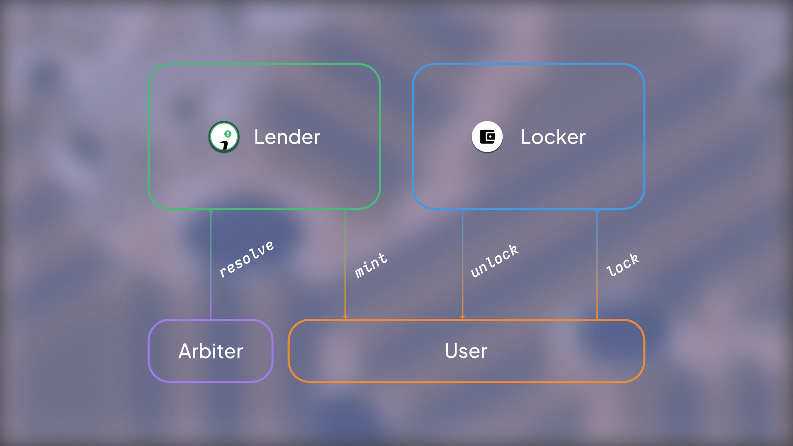

Imaginary, at it's core, consists of the Lender and associated Lockers. 

## Architecture Overview

🚧 visualization coming soon

## Lockers
Lockers allow users to deposit assets from their wallet. Once in the locker, the user can utilize the value within the asset. For example, they may use the locker (and the assets inside) as collateral to borrow stablecoins, natively at 0% interest APY.

## Lender
The Lender is where users can issue stablecoins against their locked collateral.

## IMGY Token
The Imaginary Token ($IMGY) is our protocol token and comes with special utility. For example, the token can be used to vote on future proposals or gain access to protcol revenue in the form of borrowing power. 

We are always looking for new ideas and ways to expand the token's utility. Have one? We'd love to hear it!

Secret Word is *grenadine*